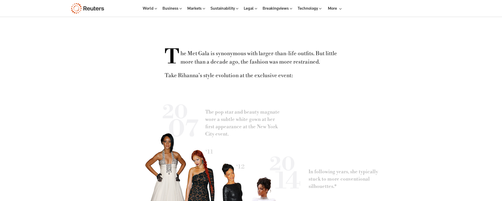
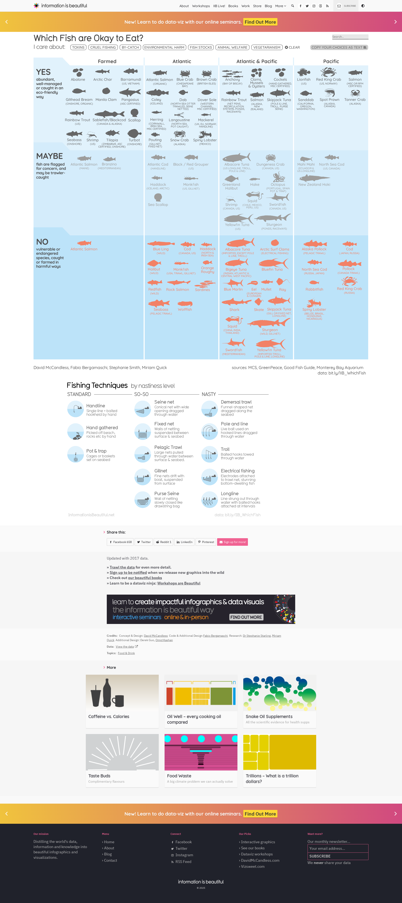
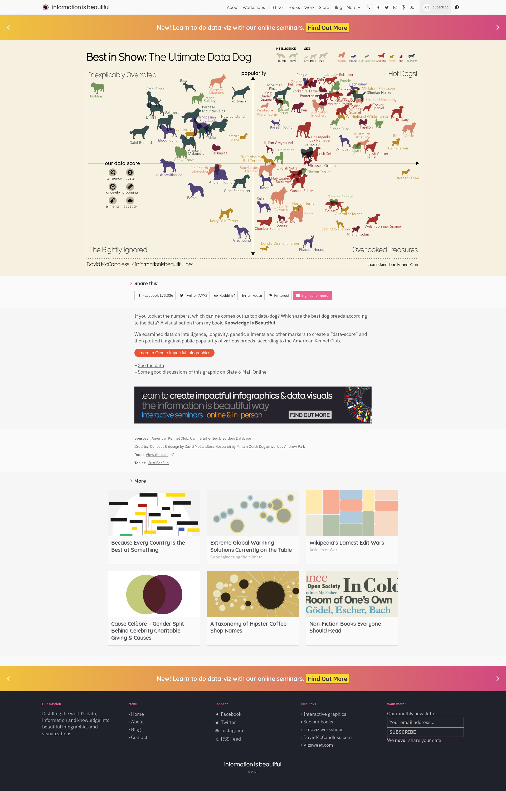
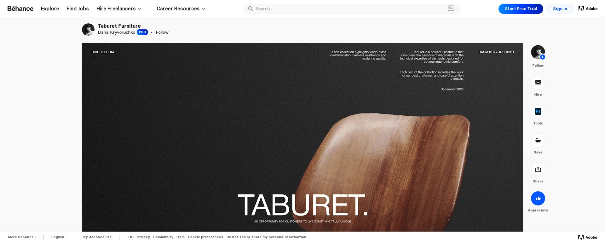
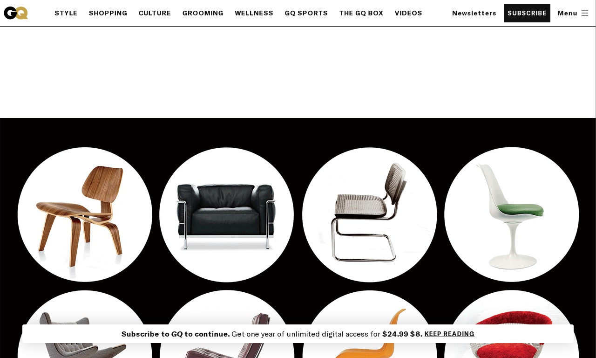
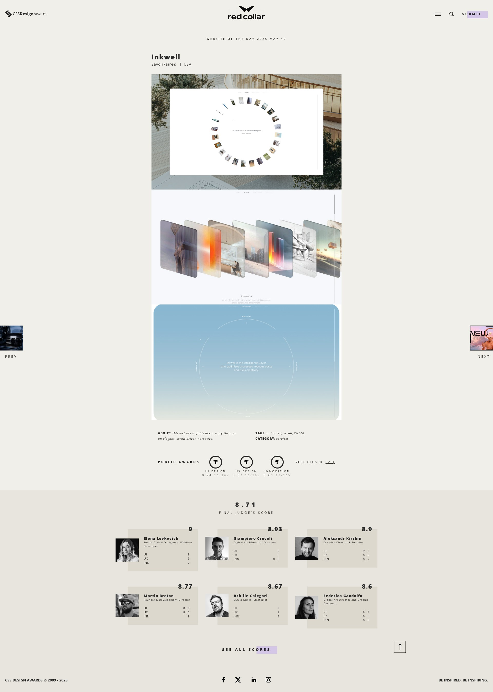

# DISENO-Y-PROGRAMACION
# Trabajo Final - Desarrollo Web y Diseño Visual de Información

## Tema: Iconos del Diseño de Sillas Modernas

Este proyecto explora una selección de las sillas más influyentes del diseño moderno, creadas por destacados diseñadores del siglo XX como Marcel Breuer, Le Corbusier, Eero Saarinen, Charles & Ray Eames, entre otros.

El sitio está enfocado en:

- Los procesos constructivos utilizados en cada diseño (materiales, técnicas y evolución productiva).
- El contexto histórico y cultural en que fueron creadas.
- Su impacto en la historia del diseño (premios, ventas, repercusión).
- Comparaciones entre distintos estilos y aproximaciones formales.

## Sillas destacadas

- **Wassily Chair** – Marcel Breuer  
- **LC4 Chaise Longue** – Le Corbusier, Charlotte Perriand & Pierre Jeanneret  
- **Tulip Chair** – Eero Saarinen  
- **Eames Lounge Chair** – Charles & Ray Eames  
- **Barcelona Chair** – Ludwig Mies van der Rohe  
- **Paimio Chair** – Alvar Aalto  
- **Red and Blue Chair** – Gerrit Rietveld  
- **Pantone Chair** – Verner Panton  

## Fuentes de datos principales

- Catálogos oficiales y archivos de marcas como **Knoll**, **Herman Miller** y **Cassina**.
- Libros especializados en historia del diseño.
- Artículos académicos y ensayos sobre diseño industrial y mobiliario moderno.
- Sitios web de museos como el **MoMA** y el **Vitra Design Museum**.
- Bases de datos y revistas digitales como **Design Museum**, **Dezeen** y **ArchDaily**.

## Inspiración visual y metodológica

El diseño visual del sitio web, así como la organización de la información, se inspiraron en plataformas reconocidas por su uso de infografías, visualización de datos y dashboards interactivos:

- [Reuters Graphics](https://www.reuters.com/graphics/)
  

## Referencias

- Fiell, Charlotte & Peter. *1000 Chairs*. Taschen, 2005.  
- Dormer, Peter. *Design Since 1945*. Thames & Hudson, 1993.  
- Webb, Michael. *The Eames Lounge Chair: An Icon of Modern Design*. Rizzoli, 2006.  
- Sitio oficial de [Herman Miller](https://www.hermanmiller.com/)  
- Sitio oficial de [Knoll](https://www.knoll.com/)  
- [Vitra Design Museum](https://www.design-museum.de/)

[Which Fish Best to Eat](https://informationisbeautiful.net/visualizations/which-fish-best-safest-healthy-to-eat/)

[Best In Show - Data Dog](https://informationisbeautiful.net/visualizations/best-in-show-whats-the-top-data-dog/)

[Taburet Furniture – Behance](https://www.behance.net/gallery/158943715/Taburet-Furniture)

# REFERENTES Y ANTECEDENTES

### 1. [**The 12 Most Iconic Chairs of All Time** – GQ](https://www.gq.com/story/the-12-most-iconic-chairs-of-all-time)

)

**¿Qué es?**
Artículo editorial que presenta una selección curada de las sillas más icónicas del diseño moderno, con imágenes circulares que rotan al hacer scroll. Funciona como una galería visual acompañada de breves descripciones y contexto histórico de cada silla.

**Dirección (fuente):**
[https://www.gq.com/story/the-12-most-iconic-chairs-of-all-time](https://www.gq.com/story/the-12-most-iconic-chairs-of-all-time)

**Aspectos positivos:**

* Excelente calidad fotográfica y presentación visual.
* Diseño simple y elegante que permite explorar cada silla como objeto individual.
* Relevancia directa con el tema de estudio.

**Aspectos negativos:**

* Poca interactividad.
* Información textual limitada en comparación con una infografía.
* No utiliza datos cuantitativos ni visualización compleja.

---

### 2. [**Best in Show: What’s the Top Data Dog?** – Information is Beautiful](https://informationisbeautiful.net/visualizations/best-in-show-whats-the-top-data-dog/)

[Best In Show - Data Dog](https://informationisbeautiful.net/visualizations/best-in-show-whats-the-top-data-dog/)

**¿Qué es?**
Visualización infográfica comparativa que ordena razas de perros según múltiples variables como inteligencia, obediencia y cuidado, utilizando íconos, colores y jerarquías claras. Es un ejemplo destacado de cómo presentar muchos datos de manera legible y visualmente atractiva.

**Dirección (fuente):**
[https://informationisbeautiful.net/visualizations/best-in-show-whats-the-top-data-dog/](https://informationisbeautiful.net/visualizations/best-in-show-whats-the-top-data-dog/)

**Aspectos positivos:**

* Comparación clara de datos complejos.
* Uso efectivo del color y el orden jerárquico.
* Inspirador para construir una visualización de comparación entre sillas.

**Aspectos negativos:**

* Demanda bastante trabajo para adaptar un formato similar en código HTML/CSS puro.
* Visualización estática, sin interactividad.
* Puede saturar si se agregan demasiadas variables.

---

### 3. [**Inkwell** – CSS Design Awards](https://www.cssdesignawards.com/sites/inkwell/47447/)

)

**¿Qué es?**
Sitio web interactivo premiado que destaca por su enfoque narrativo y tipográfico. Aunque no es una infografía de datos, ofrece una experiencia visual potente mediante scroll y transiciones, ideal para presentar contenido editorial de forma envolvente.

**Dirección (fuente):**
[https://www.cssdesignawards.com/sites/inkwell/47447/](https://www.cssdesignawards.com/sites/inkwell/47447/)

**Aspectos positivos:**

* Diseño visual limpio y atractivo.
* Excelente uso de tipografía y layout editorial.
* Inspira presentaciones que combinan diseño y storytelling.

**Aspectos negativos:**

* No representa datos.
* Requiere mayor conocimiento técnico para replicar.
* No es un referente directo en visualización de información.

